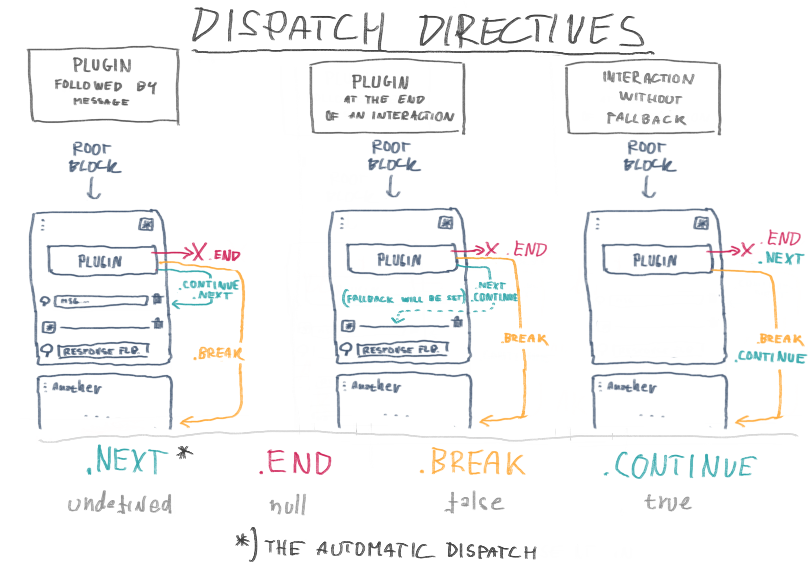

# Plugins

Plugins are **the best way to provide API integrations and business logic** to your chatbot. Plugins is a serverside code with customisable representation in a wingbot.ai designer.

## Plugin representation in designer

Each plugin can be used as any other conversation element like message.


## Configuring the designer

```json
[
  {
    "id": "exampleBlock",
    "name": "example block name",
    "description": "example block description text",
    "inputs": [
      {
        "type": "text",
        "name": "text",
        "label": "Text",
        "validations": [
            {
                "type": "regexp",
                "value": "^(\\s*).{0,2}$",
                "message": "Should not be shorter than 3 letters!"
            }
        ]
      },
      {
        "type": "select",
        "name": "sel",
        "label": "Select",
        "options": [
          {
            "value": "val",
            "label": "lab"
          }
        ]
      }
    ],
    "items": [
      {
        "id": "responseBlockName",
        "description": "description of an interaction block"
      }
    ]
  }
]
```

You can specify:

- **inputs** - configuration of each plugin

    There are two types: `text`, `select`, `array` and `postback`. Input data are accessible in `params` as a 5th parameter of plugin and in `req.params`.

- **items** - the response blocks

    Blocks of conversation elements to respond with. How to **pass the data** to messages? You can use `res.setData({ myVar: 'foo' })` and use the Handlebars template in message like `{{myVar}}`

## Plugin as a function

You can register your plugin simply.

```javascript
const { Plugins } = require('wingbot');

const plugins = new Plugins();

plugins.register('exampleBlock', async (req, res, postBack) => {
    // load the plugin configuration
    const { text, sel } = req.params;

    // set data to make them accessible in handlebars templates
    res.setData({ myVar: text' });

    // run an interaction block
    await res.run('responseBlockName');
});

module.exports = plugins;
```
## Understanding return values

How to use directives `Router.NEXT`, `Router.END`, `Router.CONTINUE` and `Router.BREAK`



## Plugin as a nested Router

For more sophisticated use cases you can use the router as a plugin. **But don't forget to register it as a factory!**

```javascript
const { Plugins, Router } = require('wingbot');

const plugins = new Plugins();

function exampleBlockFactory (params) {
  // load the plugin configuration
  const { text } = params;

  // there you're able to validate the params

  const exampleBlock = new Router();

  // an incomming route
  exampleBlock.use('/', (req, res, postBack) => {

      // send the text as a response
      res.text(text);

      // make some async job
      postBack('after-timeout', async () => {
          await new Promise(r => setTimeout(r, 1000));
          return { myVar: 'foo' };
      });
  });

  // following action
  exampleBlock.use('after-timeout', async (req, res) => {
      const { myVar } = req.actionData();

      await res.run('responseBlockName');
  });

  return exampleBlock;
}

plugins.registerFactory('exampleBlock', exampleBlockFactory);

module.exports = plugins;
```

## Testing the plugin

You can use the Tester util.

```javascript
const { Tester } = require('wingbot');
const plugins = require('../../bot/plugins');

describe('exampleBlock plugin', function () {

    it('should work', async function () {
        const t = new Tester(plugins.getPluginFactory('exampleBlock'));

        await t.postBack('/'); // run the initial action

        await new Promise(r => setTimeout(r, 1500));

        // asserts
        t.respondedWithBlock('responseBlockName');
        t.passedAction('after-timeout');
    });

});
```

## Nested forms in plugin configuration

if you want to gather **array of objects** for your plugin's configuration, you can use an `array` input type.

- `keyPropertyName: string` - required identifying property of each object
- `column: { name: string, label: string }[]` - to make the table more readable, theres ability to show additional label columns

```json
{
  "type": "array",
  "name": "products",
  "label": "List of products",
  "keyPropertyName": "ean",
  "columns": [ // optional
    {
      "name": "product_name",
      "label": "Product name"
    }
  ],
  "inputs": [
    {
      "type": "text",
      "name": "ean",
      "label": "Unique identification of product"
    },
    {
      "type": "text",
      "name": "product_name",
      "label": "Product name"
    }
  ]
}
```

This input will produce a params object like this:

```javascript
{
  products: [
    {
      ean: '123132321',
      product_name: 'Foo'
    },
    {
      ean: '8989898',
      product_name: 'Bar'
    }
  ]
}
```